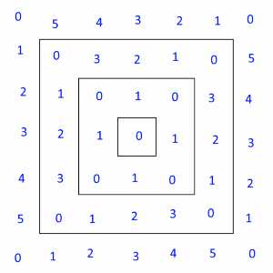

# Day 3 Part 1
## Solution

http://adventofcode.com/2017/day/3

In the beginning we have such spirally incremented structure  
  

We can calculate the lower-right number of every layer (here: 1, 9, 25, 49) with this formula:

`n`: the layer number, counted from 1  
when: `n = 1`  
then: `f(n) = 1`

when: `n > 1`  
then: `f(n) = sum of ((n * 2 - 2) * 4)` (including the `n = 1`)

Having this formula we can find on which layer is our input number `x`. Simply you need to find such `n` which `f(n)` is higher than `x` but `f(n-1)` is lower.  
This value will be essential to calculate the steps from center to given field `x`

Calculating how much fields `s` is on `n`-th layer is also simple, just subtract lower layer from this layer:  
`s = f(n) - f(n-1)`

Then we need to find where on the layer our `x` is, by calculating the overflow, by doing similar calculation as above:  
`x' = x - f(n-1)`  

We have value of how "deep" into the structure is our `x`. This value is represented by `n`  
Then we have to find how to calculate how many "horizontal" steps we need to take to reach `x` in minimal amount of steps.  
Let's call this value `min_horizontal_steps`  
Therefore we need a following mask:

First step to achieve this is dividing the `x` overflow by 4 resulting with:

Then we subtract the 8'th part of `x` overflow and we have this:

math.Abs will do the rest here.

The solution is: `n + min_horizontal_steps`